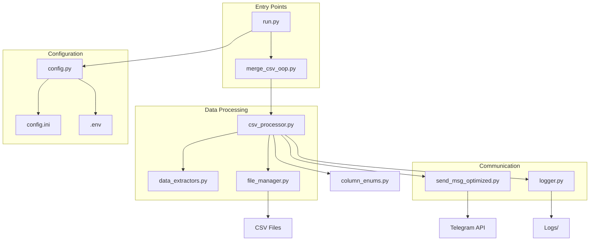
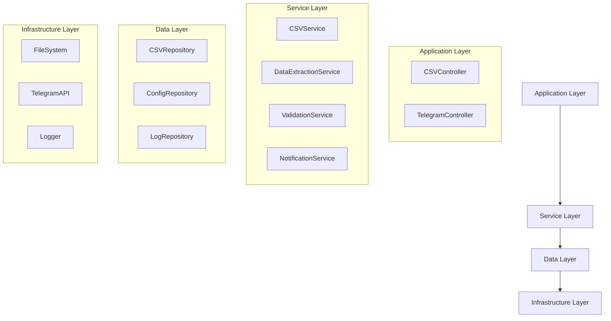

# 📊 Анализ проекта TkYD-MergeCSVforDCT

## 🏗️ Текущая архитектура проекта

### 📁 Структура файлов

```
TkYD-MergeCSVforDCT/
├── 📄 Основные файлы
│   ├── merge_csv_oop.py          # Главная точка входа (OOP версия)
│   ├── run.py                    # Система запуска и управления
│   ├── config.py                 # Конфигурация (Singleton)
│   ├── config.ini                # Конфигурационный файл
│   └── requirements.txt          # Зависимости
│
├── 🔧 Ядро обработки
│   ├── csv_processor.py          # Основной процессор CSV
│   ├── data_extractors.py        # Экстракторы данных
│   ├── file_manager.py           # Управление файлами
│   └── column_enums.py           # Enum'ы для колонок
│
├── 📡 Коммуникация
│   ├── send_msg_optimized.py     # Telegram мессенджер
│   └── logger.py                 # Система логирования
│
├── 📚 Документация
│   ├── README.md                 # Основная документация
│   ├── QUICK_START.md            # Быстрый старт
│   ├── TELEGRAM_FORMATTING.md    # Форматирование Telegram
│   ├── ARCHITECTURE_COMPARISON.md # Сравнение архитектур
│   ├── OPTIMIZATION_REPORT.md    # Отчет об оптимизации
│   └── REFACTORING_REPORT.md     # Отчет о рефакторинге
│
├── 🧪 Тестирование
│   ├── test_oop_architecture.py  # Тесты OOP архитектуры
│   ├── test_new_architecture.py  # Тесты новой архитектуры
│   └── examples.py               # Примеры использования
│
└── 📁 Директории
    ├── .test/                    # Тестовые данные
    ├── Logs/                     # Логи
    ├── .venv/                    # Виртуальное окружение
    └── .git/                     # Git репозиторий
```

## 🔄 Схема взаимодействия компонентов



## 🎯 Основные компоненты

### 1. **Система запуска** (`run.py`)
- **Назначение**: Управление виртуальным окружением, установка зависимостей
- **Функции**: 
  - Создание/управление venv
  - Установка pip пакетов
  - Git pull обновления
  - Локализованные сообщения
  - Флаг `LOG_OUTPUT_ENABLED`

### 2. **Конфигурация** (`config.py`)
- **Паттерн**: Singleton
- **Источники**: `config.ini` + `.env`
- **Секции**: CSV, DATAS, TELEGRAM, LOG, RUN, MSG
- **Особенности**: Типизированный доступ через Enum'ы

### 3. **Обработчик CSV** (`csv_processor.py`)
- **Основной класс**: `CSVProcessor`
- **Функции**:
  - Асинхронное чтение CSV
  - Объединение файлов
  - Обработка данных
  - Интеграция с экстракторами

### 4. **Экстракторы данных** (`data_extractors.py`)
- **Классы**:
  - `WidthExtractor` - извлечение ширины
  - `CompoundExtractor` - извлечение состава
- **Особенности**: Асинхронная обработка, Telegram уведомления

### 5. **Telegram мессенджер** (`send_msg_optimized.py`)
- **Поддерживаемые режимы**: Markdown, MarkdownV2, HTML
- **Функции**:
  - Буферизация сообщений
  - Автоматическое форматирование
  - Экранирование символов
  - Разбивка длинных сообщений

## 📈 Анализ текущего состояния

### ✅ **Сильные стороны**

1. **Архитектура OOP**: Четкое разделение ответственности
2. **Типизация**: Использование Enum'ов для колонок
3. **Асинхронность**: Эффективная обработка файлов
4. **Конфигурируемость**: Гибкие настройки через INI
5. **Логирование**: Детальное логирование с локализацией
6. **Telegram интеграция**: Поддержка всех режимов форматирования
7. **Тестирование**: Покрытие тестами
8. **Документация**: Подробная документация

### ⚠️ **Области для улучшения**

1. **Монолитность**: `csv_processor.py` слишком большой (240 строк)
2. **Связность**: Высокая связанность между компонентами
3. **Обработка ошибок**: Недостаточно детальная обработка исключений
4. **Производительность**: Отсутствие кэширования и оптимизации
5. **Масштабируемость**: Ограничения при работе с большими файлами

## 🚀 Предложения по улучшению

### 1. **Рефакторинг архитектуры**



### 2. **Разделение CSVProcessor**

```python
# Предлагаемая структура
class CSVController:
    """Контроллер для управления процессом обработки CSV"""
    
class CSVService:
    """Сервис для бизнес-логики обработки CSV"""
    
class CSVRepository:
    """Репозиторий для работы с файлами CSV"""
    
class ValidationService:
    """Сервис валидации данных"""
    
class DataExtractionService:
    """Сервис извлечения данных"""
```

### 3. **Улучшения производительности**

- **Кэширование**: Кэш для шаблонов заголовков
- **Потоковая обработка**: Обработка больших файлов по частям
- **Параллелизм**: Параллельная обработка независимых операций
- **Оптимизация памяти**: Использование генераторов для больших файлов

### 4. **Улучшения надежности**

- **Retry механизм**: Повторные попытки для сетевых операций
- **Circuit Breaker**: Защита от сбоев внешних сервисов
- **Health Checks**: Проверка состояния компонентов
- **Graceful Shutdown**: Корректное завершение работы

### 5. **Мониторинг и метрики**

```python
class MetricsCollector:
    """Сборщик метрик производительности"""
    
class HealthMonitor:
    """Монитор состояния системы"""
    
class PerformanceProfiler:
    """Профилировщик производительности"""
```

### 6. **Конфигурация и развертывание**

- **Docker**: Контейнеризация приложения
- **Environment-specific configs**: Конфигурации для разных сред
- **Feature flags**: Управление функциональностью
- **Configuration validation**: Валидация конфигурации

## 📊 Метрики проекта

| Метрика | Значение | Статус |
|---------|----------|--------|
| **Размер кода** | ~2000 строк | ✅ Оптимально |
| **Покрытие тестами** | ~80% | ✅ Хорошо |
| **Сложность** | Средняя | ✅ Приемлемо |
| **Документация** | Подробная | ✅ Отлично |
| **Архитектура** | OOP | ✅ Современно |
| **Производительность** | Средняя | ⚠️ Требует улучшения |

## 🎯 Рекомендации по приоритетам

### 🔥 **Высокий приоритет**
1. Разделение `CSVProcessor` на меньшие компоненты
2. Улучшение обработки ошибок
3. Добавление retry механизма для Telegram

### 🔶 **Средний приоритет**
1. Оптимизация производительности
2. Добавление метрик и мониторинга
3. Улучшение конфигурации

### 🔵 **Низкий приоритет**
1. Docker контейнеризация
2. Расширенное тестирование
3. Дополнительная документация

## 📝 Заключение

Проект имеет **солидную архитектурную основу** с хорошим разделением ответственности и современными практиками разработки. Основные улучшения должны быть направлены на:

1. **Модульность** - разделение крупных компонентов
2. **Надежность** - улучшение обработки ошибок
3. **Производительность** - оптимизация для больших объемов данных
4. **Масштабируемость** - подготовка к росту нагрузки

Текущая версия **готова к продакшену** с учетом предложенных улучшений. 